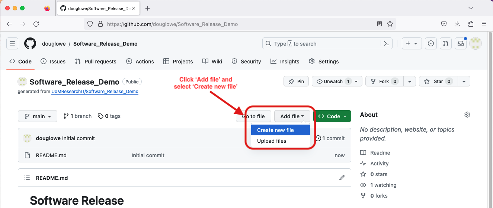
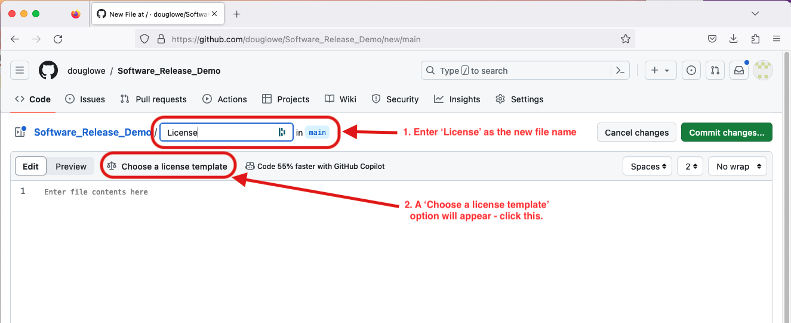
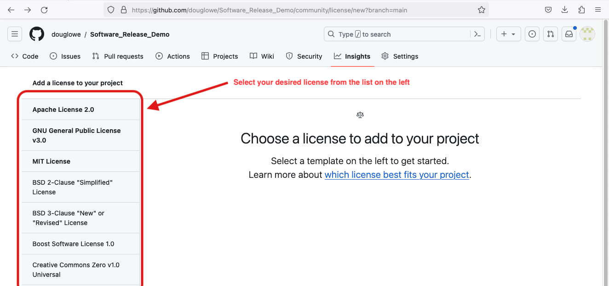
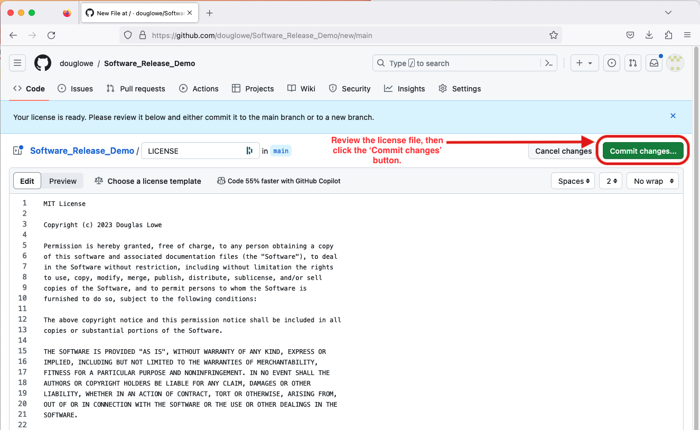

# Software Release

Before releasing software for general there are a number of common actions needed 
to ensure that others know how to:
- to use your code
- which version they are using
- how to access your code
- how to cite your work

## Document Code Use: Licensing

Most developers know that they need to document the technical details of how to use their code.
But many forget that they also need to document the social details of how their code can be used.
To establish this social contract you must release your code under a license. 
This license will guide others on what they can, and cannot, do with your code.
Without the certainty on usage that a license provides, many users won't touch your code.
Usually we will wish to use an Open Source license - so that our code is a widely useable
as possible. However there are a number of different open source licenses available,
and your choice of which to use will determine how free end users are to modify, use, and 
share your code. For details on these licenses visit [Choose a License](https://choosealicense.com).

Github enables the fast addition of a license to a repository. To make use of this, 
first you need to click the `Add file` option on the repository, and select `Create new file`.

This takes you to the interface for creating new files. Enter the filename `License` (or `License.md`,
`License.txt`, etc, as you wish). At this point a `Choose a license template` option will appear, which
you should click.

This takes you to an interface for choosing which license you want. Select one from the left of the page,
following the guide on the [Choose a License](https://choosealicense.com) website for which you want.

After selecting your desired license, fill in the details for the license in the panel on the right, then
click the `Review and submit` button.

This takes you to a preview of the license file. Check this to ensure the details are correct, then click
the `Commit changes` button, enter a commit message (e.g.: 'add license file'), and commit your changes.

Once these is done your code will be properly licensed, and you will be ready to go onto the next stage 
in releasing it.

## Versioning of your Code

**add versioning guide here**

## Sharing your Code

### Archiving

**Zenodo instructions here**

### Releasing

**pip and conda packaging?**

## Provide Citation for your Code

End users of your code may wish to reference it in their publications. To help them with this,
and to make sure that references to your work are consistent, you can add a `CITATION.cff` file
to your repository. This plain-text file provides others with information on how you want them
to cite your work. Github will also parse this file to provide users with an interface on
your repository to access the citation information.

**add instructions here**

You can get more information on these files from [Rob Haines' blog post](https://research-it.manchester.ac.uk/news/2021/09/09/introducing-software-citation/)
and from the [Github documentation page](https://docs.github.com/en/repositories/managing-your-repositorys-settings-and-features/customizing-your-repository/about-citation-files). 

