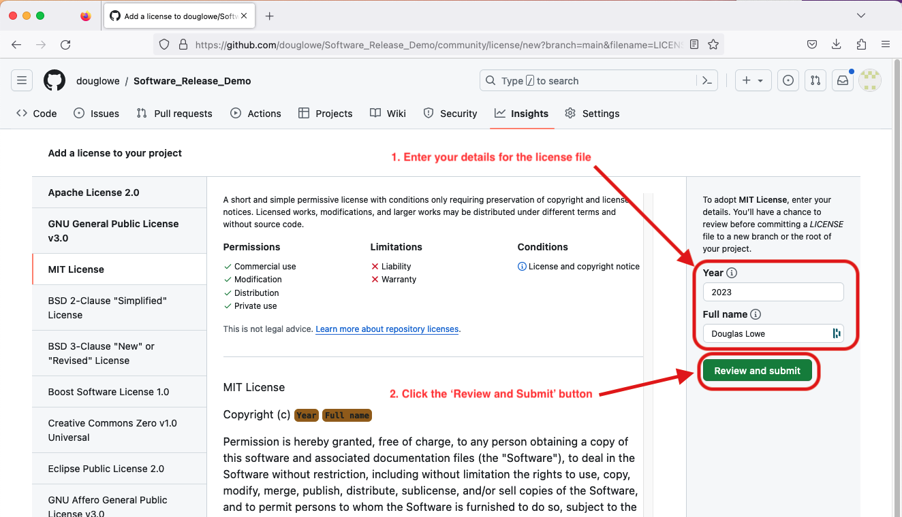

# Software Release

Before releasing software for general there are a number of common actions needed 
to ensure that others know:
1. how they can use your code ([licensing](#Licensing))
2. which version they are using ([tagging](#Tagging))
3. how to find and access your code ([archiving and sharing](#Sharing))
4. how to cite your work ([citation](#Citation))

## Document Code Use: Licensing

Most developers know that they need to document the technical details of how to use their code.
But many forget that they also need to document the social details of how their code can be used.
To establish this social contract you must release your code under a license. 
This license will guide others on what they can, and cannot, do with your code.
Without the certainty on usage that a license provides, many users won't touch your code.
Usually we will wish to use an Open Source license - so that our code is a widely useable
as possible. However there are a number of different open source licenses available,
and your choice of which to use will determine how free end users are to modify, use, and 
share your code. For details on these licenses visit [Choose a License](https://choosealicense.com).

Github enables the fast addition of a license to a repository. To make use of this, 
first you need to click the `Add file` option on the repository, and select `Create new file`.

This takes you to the interface for creating new files. Enter the filename `License` (or `License.md`,
`License.txt`, etc, as you wish). At this point a `Choose a license template` option will appear, which
you should click.

This takes you to an interface for choosing which license you want. Select one from the left of the page,
following the guide on the [Choose a License](https://choosealicense.com) website for which you want.

After selecting your desired license, fill in the details for the license in the panel on the right, then
click the `Review and submit` button.

This takes you to a preview of the license file. Check this to ensure the details are correct, then click
the `Commit changes` button, enter a commit message (e.g.: 'add license file'), and commit your changes.

Once these is done your code will be properly licensed, and you will be ready to go onto the next stage 
in releasing it.

## Versioning of your Code

To help end users of your code to document what they are using for their research,
it is sensible to tag significant releases of your code. On GitHub, this creates a
human-readable label for the selected commit, helping others to find it.

### Semantic Versioning

There are many different versioning methods. A popular one to consider is [Semantic Versioning](https://semver.org/),
where a given version number uses the format MAJOR.MINOR.PATCH. When updating a 
semantic version number you increment the:
- MAJOR version when you make incompatible API changes
- MINOR version when you add functionality in a backwards compatible manner
- PATCH version when you make backwards compatible bug fixes
You can also add a hyphen followed by characters to denote a pre-release version, e.g. 1.0.0-alpha1, or 1.2.3-beta4.

### Tagging a Release in GitHub

Instructions for tagging a release via the command line are given in the [Python Intermediate Development course](https://carpentries-incubator.github.io/python-intermediate-development/42-software-reuse/index.html#tagging-a-release-in-github).

To create a release from the GitHub website interface, first click the 'Create a new release' 
option on the right of the repository webpage.

This opens the Releases dialog page. Click on the 'Choose a tag' button on the left of the page, 
and enter your new tag number in the dialog box that this presents you.

The 'Choose a tag' button will be replaced with your tag number. Now add information about the release 
to the release title and description dialog boxes. Once you are happy with the information added click
the green 'Publish release' button at the bottom left of the page.

## Sharing your Code

Github is a good platform for code development and sharing. But it is not an ideal platform for
the storage of research code - where, unlike standard software, there is often a need to be able 
to refer back to codes that were developed 5, 10, or even 20 years ago. For this requirement we
need to look to data archiving services, such as FigShare or Zenodo, which will create permanent
digitial archives with fixed digital object identifiers (DOI's) which will always point to the
same code.

### Archiving

The easiest method to archive your code on Zenodo is to link your Zenodo and GitHub accounts 
together. This can be done from the Zenodo 'My account' page. Once linked you can browse a 
list of your repositories (warning: this will be long if you're a member of several organisations!),
to find the repository you wish to archive. Toggle the switch for this repository, and then
Zenodo will automatically archive any tagged release from that repository.

### Releasing

**pip and conda packaging?**

## Provide Citation for your Code

End users of your code may wish to reference it in their publications. To help them with this,
and to make sure that references to your work are consistent, you can add a `CITATION.cff` file
to your repository. This plain-text file provides others with information on how you want them
to cite your work. Github will also parse this file to provide users with an interface on
your repository to access the citation information.

Creation of the `CITATION.cff` file is started in the same manner as the `LICENSE` file, clicking
the 'Add file' button, and selecting 'Create new file'.

Once you are on the create new file page enter the filename `CITATION.cff`. At this point a panel
describing citation files will appear at the top of the page - click the 'Insert example' button
in that panel.

Now edit the example file. You should start by adding your details, as well as those of any co-authors.
Then change the version number to the one you created earlier, and add the DOI provided by Zenodo.
Once you are happy with the details entered click the green 'Commit changes' button in the top right corner.

The presence of a `CITATION.cff` file in your repository adds a 'Cite this repository' menu in the panel
on the right of your repository homepage. Clicking this option will review a dialog box, in which you can
chose the format you want the citation (currently either APA or BibTeX), and copy the generated citation text.
Or you can directly view the citation file.

You can get more information on citation files from [Rob Haines' blog post](https://research-it.manchester.ac.uk/news/2021/09/09/introducing-software-citation/)
and from the [Github documentation page](https://docs.github.com/en/repositories/managing-your-repositorys-settings-and-features/customizing-your-repository/about-citation-files). 

